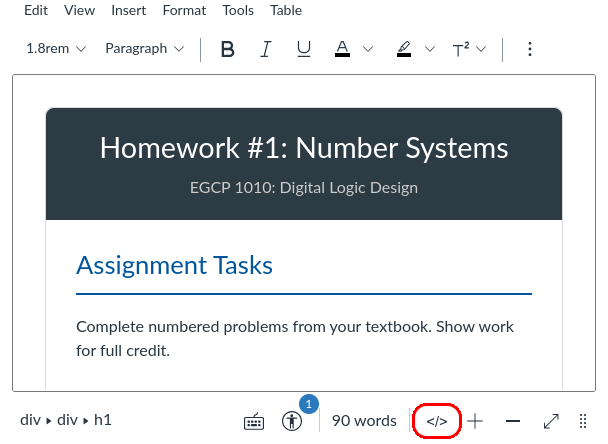

# EGCP-1010: Digital Logic Design
## Description
A full redesign of EGCP-1010 Canvas shell with a focus on readability. Designed in cooperation with Dr. Clint Kohl.

## How to Use
HTML templates can be copy-pasted directly into Canvas' HTML editor. To access the HTML editor, click the HTML button (`</>`) or click View -> Edit HTML
